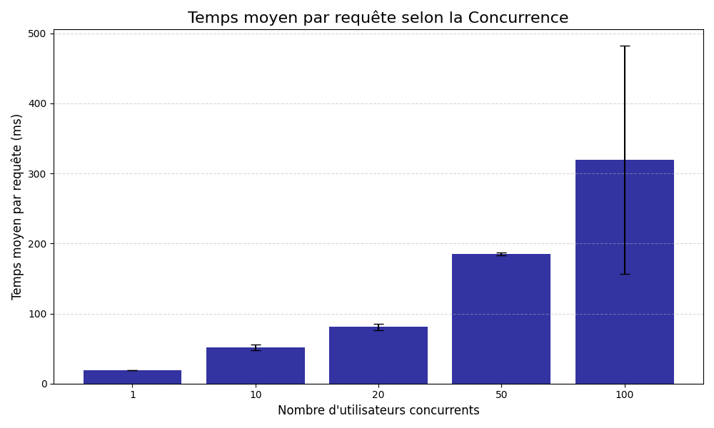
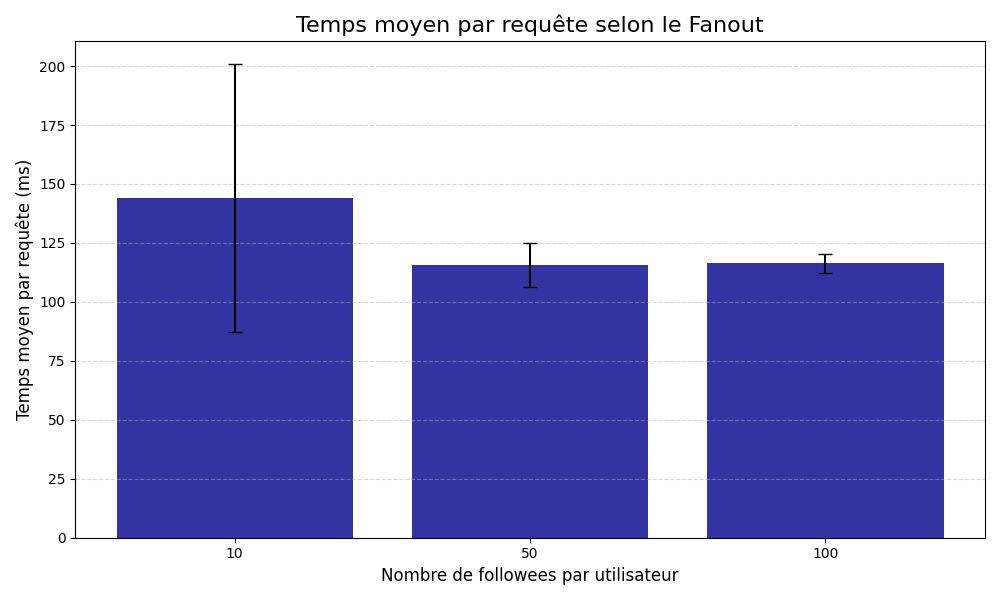

# PROJET DONNÉES MASSIVES ET CLOUD : BENCHMARK TINYINSTA

## 🚀 Objectif du Projet

Ce projet a pour but d'évaluer les performances de l'application de réseau social minimaliste **TinyInsta** (déployée sur Google Cloud Platform) en mesurant le temps d'exécution de la fonctionnalité **`timeline`** face à deux variables clés :

1.  L'augmentation de la **charge concurrente** (nombre d'utilisateurs simultanés).
2.  L'augmentation de la **taille des données** (nombre de *posts* et *fanout*).

---

## 🔗 Liens de Soumission

| Ressource | URL |
| :--- | :--- |
| **Application Déployée (App Engine)** | https://tinyinsta1.ew.r.appspot.com/ |
| **Dépôt Git** |https://github.com/Moustapha2526/TinyIsnta.git | 

---

## ⚙️ Méthodologie

Les tests de performance ont été réalisés en utilisant **Apache Bench (ab)**. Chaque configuration a été testée sur **3 *runs*** afin de calculer la moyenne et la variance.

| Paramètre Fixe | Test Concurrence | Test Posts | Test Fanout |
| :--- | :--- | :--- | :--- |
| **Utilisateurs Totaux** | 1000 | 1000 | 1000 |
| **Concurrence** | **Varie (1 à 1000)** | **50** | **50** |
| **Posts/Utilisateur** | 50 | **Varie (10 à 1000)** | 100 |
| **Followees/Utilisateur** | 20 | 20 | **Varie (10 à 100)** |

Les résultats bruts sont disponibles dans les fichiers CSV du dossier **`out/`**.

---

## 📊 Résultats des Benchmarks (Graphiques)

Les graphiques ci-dessous montrent l'évolution du temps moyen d'exécution de la requête `timeline` (en millisecondes). Les **barres d'erreur** représentent l'écart-type des 3 *runs* (la variance).

### 1. Temps moyen selon la Concurrence (`conc.png`)

Mesure de l'impact du nombre de requêtes simultanées.

 

### 2. Temps moyen selon le Nombre de Posts (`post.png`)

Mesure de l'impact du volume total de messages à traiter.

 

### 3. Temps moyen selon le Fanout (`fanout.png`)

Mesure de l'impact de la complexité d'agrégation de la *timeline* (nombre de sources à fusionner).

 

---

## 💾 Fichiers de Données

Les fichiers CSV générés au format large (`PARAM, RUN_1, RUN_2, RUN_3`) sont disponibles ici :

* **`out/conc.csv`**
* **`out/post.csv`**
* **`out/fanout.csv`**